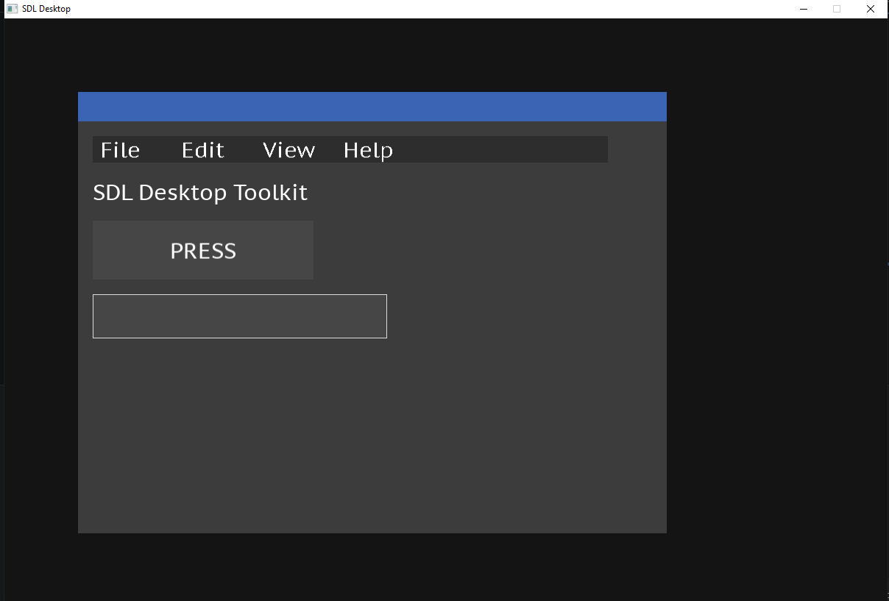
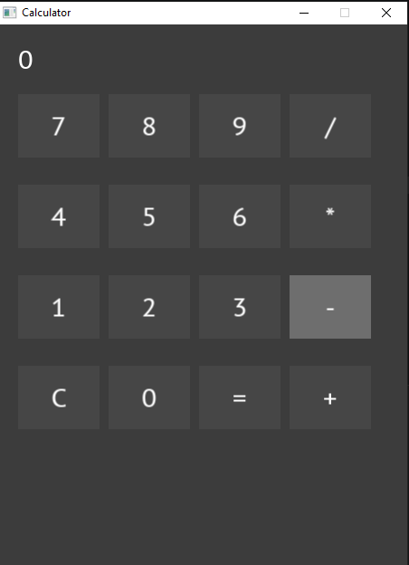
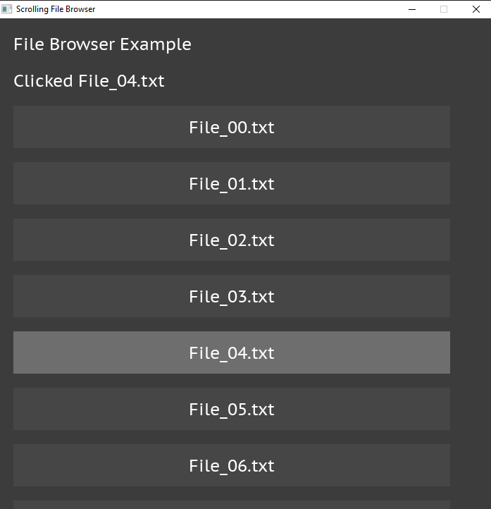

# SDL Desktop Toolkit

A lightweight desktop UI toolkit written entirely in **C using SDL3 + SDL_ttf**.

This project provides a small collection of reusable widgets and layout systems for building desktop-style interfaces without external GUI frameworks.

Features include:

- Window system
- Buttons
- Labels
- Textboxes
- Menu bars with dropdown support
- Panels (vertical + horizontal layouts)
- Widget alignment and sizing
- Overlay rendering
- Scrollable containers
- Example applications

---

# Screenshots

## Desktop Example




---

## Calculator Example





## Scrolling Example




---

# Features

## Widgets

### Window
Draggable desktop-style window container.

Supports:
- Title bar
- Child widgets
- Overlay rendering
- Nested layouts

---

### Panel

Flexible container widget.

Supports:

- Vertical layout
- Horizontal layout
- Padding
- Spacing
- Scroll support
- Nested panels

---

### Button

Interactive clickable button.

Supports:

- Hover state
- Press state
- Callback functions

---

### Label

Simple text rendering widget.

Supports:

- Dynamic text
- Font rendering

---

### TextBox

Editable text input field.

Supports:

- Keyboard input
- Focus state
- Cursor display

---

### MenuBar

Desktop application menu.

Supports:

- Hover highlighting
- Dropdown menus
- Overlay rendering
- Callbacks

---

# Project Structure

```text
project/
│
├── include/
│   ├── widget.h
│   ├── panel.h
│   ├── window.h
│   ├── button.h
│   ├── label.h
│   ├── textbox.h
│   ├── menu_bar.h
│   └── file_dialog.h
│
├── src/
│   ├── widget.c
│   ├── panel.c
│   ├── window.c
│   ├── button.c
│   ├── label.c
│   ├── textbox.c
│   ├── menu_bar.c
│   └── file_dialog.c
│
├── examples/
│   ├── main.c
│   └── calculator.c
│
├── docs/
│
├── CMakeLists.txt
│
└── README.md
```

---

# Dependencies

Required:

- SDL3
- SDL3_ttf

Install SDL:

## Windows

Install using:

```bash
vcpkg install sdl3 sdl3-ttf
```

or download binaries.

---

## Linux

Ubuntu:

```bash
sudo apt install libsdl3-dev
sudo apt install libsdl3-ttf-dev
```

---

# Building

## Clone

```bash
git clone https://github.com/trevorcraig/SDL_desktop.git

cd SDL_desktop
```

---

## Build

```bash
mkdir build

cd build

cmake ..

cmake --build .
```

---

# Running Examples

Desktop toolkit:

```bash
./build/demo_main
```

Calculator:

```bash
./build/demo_calculator
```

---

# Quick Start

Create a button:

```c
Button button;

Button_Init(
    &button,
    0,
    0,
    300,
    80,
    "CLICK",
    font,
    MyCallback
);

Window_Add(
    &window,
    (Widget*)&button
);
```

---

Create a textbox:

```c
TextBox textbox;

TextBox_Init(
    &textbox,
    0,
    0,
    400,
    60,
    font
);

Window_Add(
    &window,
    (Widget*)&textbox
);
```

---

Create a menu:

```c
MenuBar menu;

MenuBar_Init(
    &menu,
    0,
    0,
    700,
    36,
    font
);

MenuBar_Add(
    &menu,
    "File",
    NULL
);

MenuBar_AddDropdown(
    &menu,
    0,
    "Open",
    OpenClick
);
```

---

# Layout System

Panels arrange child widgets automatically.

## Vertical

```text
[Widget]
[Widget]
[Widget]
```

---

## Horizontal

```text
[Widget][Widget][Widget]
```

---

Example:

```c
Panel_SetLayout(
    &panel,
    PANEL_HORIZONTAL
);
```

---

# Widget Properties

## Alignment

```c
Widget_SetAlign(
    widget,
    ALIGN_CENTER,
    ALIGN_TOP
);
```

Available:

```text
ALIGN_LEFT
ALIGN_CENTER
ALIGN_RIGHT
ALIGN_FILL

ALIGN_TOP
ALIGN_MIDDLE
ALIGN_BOTTOM
ALIGN_VFILL
```

---

## Fill Width

```c
Widget_SetFillWidth(
    widget
);
```

---

## Flex

```c
Widget_SetFlex(
    widget,
    0.5f
);
```

---

# Examples Included

## Desktop Demo

Demonstrates:

- Window
- Menu bar
- Button
- Textbox

File:

```text
examples/main.c
```

---

## Calculator

Demonstrates:

- Nested panels
- Grid layouts
- Button callbacks
- Dynamic labels

File:

```text
examples/calculator.c
```

---

# Design Goals

This project intentionally avoids:

- Large GUI frameworks
- Platform-specific UI code
- Hidden allocations
- Complex retained UI systems

Goals:

✔ Simple C API  
✔ SDL only  
✔ Easy embedding  
✔ Educational codebase  
✔ Lightweight widgets

---

# Documentation

Source files include Doxygen comments.


---

# Optional SQLite Support

The toolkit itself does **not require SQLite**.

SQLite is only used by selected examples (such as the Contacts application).

This keeps the core library lightweight and avoids unnecessary dependencies.

## Project Structure

```text
src/
include/
examples/
assets/

third_party/
└── sqlite/
    ├── sqlite3.c
    └── sqlite3.h

---

# Roadmap

Future ideas:

- [ ] Checkbox
- [ ] Radio button
- [ ] Progress bar
- [ ] Tabs
- [ ] Tree view
- [ ] Docking
- [ ] Theme system
- [ ] Resizable windows
- [ ] Text selection
- [ ] Clipboard support

---

# Contributing

Contributions are welcome.

Ideas:

- New widgets
- Examples
- Bug fixes
- Documentation


Built with SDL3 + C
'''